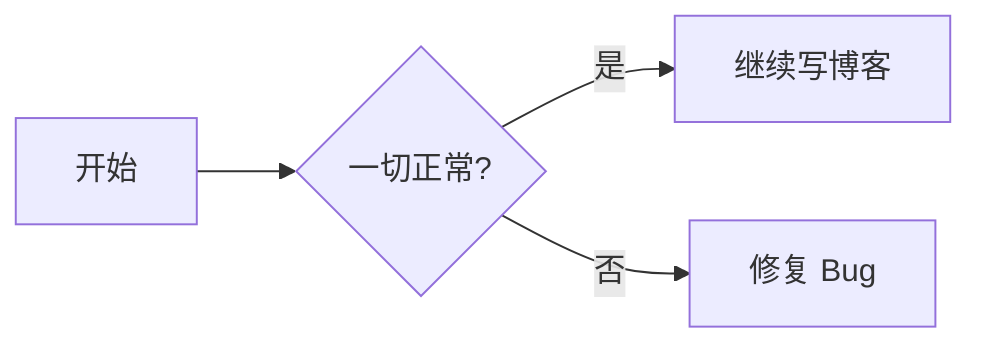

## 欢迎来到我的博客

这是一篇测试文章，用来验证博客的功能是否正常。

### 功能测试

#### 1. 数学公式

$$ E = mc^2 $$

#### 2. 代码高亮

```python
def hello():
    print("Hello, World!")
```

#### 3. Mermaid 流程图


```mermaid
graph LR
    A[开始] --> B{一切正常?}
    B -->|是| C[继续写博客]
    B -->|否| D[修复 Bug]
```

希望你喜欢这个新博客！
