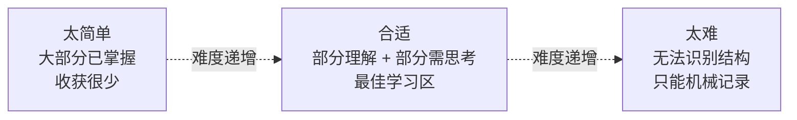
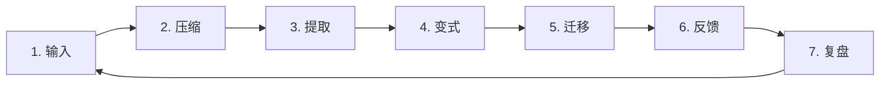

# 不要只是知道更多，要让自己变得更会思考

我们常常用一些容易衡量的东西来判断学习成果：

读了多少页书，听了多少节课，收藏了多少资料，记住了多少概念，连续学习了多少小时。

这些数字能证明我们花过时间，却不能证明我们真的发生了变化。

一个人接触的信息越来越多，并不意味着他的理解力、判断力和解决问题的能力也在同步增长。有时候，我们只是把大量内容暂时搬进了脑子，却没有把它们组织成能够反复使用的知识结构。

真正值得追求的学习，不是“我又知道了一件事”，而是：

> 我是否获得了一种以前没有的理解方式、判断方法或行动能力？

## 一、信息不等于知识，知识也不等于能力

有些信息很难记住，却没有多少长期价值。

比如一串随机字符、一份堆满术语却没有清晰逻辑的材料，或者大量彼此孤立的细节。它们可能占用很多记忆，也可能让人感到疲惫，但这种疲惫并不一定意味着我们正在进行深度学习。

困难本身不值得崇拜。

有些困难只来自表达混乱、材料过量、背景知识不足，或者无意义的机械记忆。它们消耗精力，却很少帮助我们建立可迁移的能力。

真正有价值的困难，会迫使我们完成一些重要的认知工作：

* 比较相似概念之间的区别；
* 从多个例子中找出共同规律；
* 解释一件事情为什么会发生；
* 判断一个方法什么时候适用、什么时候失效；
* 把已经学到的原理用于陌生的问题；
* 在没有提示的情况下重新构建推理过程。

因此，以后面对一份很难的学习材料，我不应该只问：

“我能不能坚持看完？”

我更应该问：

“这种困难正在迫使我学会什么？”

如果答案只是记住更多零散细节，那么即使材料很难，也未必值得投入大量时间。

## 二、学习的核心，是把复杂内容压缩成可复用的结构

理解一个主题，往往意味着我们能用更少的原则解释更多的现象。

初学者容易把每个案例都当成独立事件。他会记住很多答案，却不知道这些答案之间有什么联系。

而真正理解的人，会逐渐发现隐藏在案例背后的结构。

他不再分别记住二十种沟通失败，而会看见几个反复出现的原因：

目标不清楚，利益不一致，信息不对称，情绪受到威胁，反馈机制失效。

他不再分别背诵几十道数学题，而会识别：

这道题的关键是不变量，那道题需要分类讨论，另一道题其实是在寻找递归关系。

一旦形成这种结构，知识就不再是一堆需要逐项搬运的内容，而会变成可以重复调用的工具。

所以，学习完一个主题后，我应该问自己：

1. 这些内容共同在解释什么？
2. 最核心的机制是什么？
3. 哪些细节只是例子，哪些原则可以迁移？
4. 这个方法的适用边界在哪里？
5. 我能不能用它解释一个材料中没有出现的新问题？

如果我只能复述原文，却不能回答这些问题，那么我拥有的很可能只是熟悉感，而不是理解。

## 三、学习不是把信息装进去，而是主动重组信息

被动阅读很容易产生一种错觉。

当一句话再次出现时，我觉得自己“认识它”；当老师继续讲解时，我觉得自己“听懂了”；当答案摆在眼前时，我觉得自己“本来也会”。

但认识不等于回忆，听懂不等于掌握，看懂答案也不等于能够独立解决问题。

真正的学习通常发生在我必须主动重建内容的时候。

比如：

* 合上书，用自己的话解释刚刚学到的东西；
* 不看答案，重新走一遍推理过程；
* 把一个概念讲给完全不了解它的人；
* 写下一篇文章，迫使自己组织逻辑；
* 尝试解决一个稍有变化的新问题；
* 根据结果倒推原因；
* 发现自己解释不清的地方，再回到材料中补足。

这些活动并不只是检查学习成果。它们本身就是学习过程。

输出不是输入结束后的附加环节。输出会迫使我们发现概念之间的关系，暴露模糊的理解，并重新组织原本松散的知识。

以后读完一章书，我不应该立刻翻回去重读。我可以先停下来，尝试写下三个问题的答案：

* 这一章试图解决什么问题？
* 它给出的核心解释是什么？
* 这个解释还能用到哪里？

如果写不出来，说明我还没有真正完成学习。

## 四、学习顺序会决定我最终学到什么

同样的内容，用不同的顺序接触，最后形成的理解可能完全不同。

一个合理的学习过程，通常不是从抽象定义和大量细节开始，而是从问题和直觉开始。

我需要先知道：

这个概念为什么会出现？它想解决什么困难？如果没有它，我们会遇到什么问题？

在建立了问题意识之后，再学习概念、原理和形式化表达，知识才容易找到可以依附的位置。

一个常见而有效的顺序是：

但学习不能永远停留在正向过程。

只会从条件推导答案，可能意味着我熟悉步骤，却不理解系统。更深入的训练，往往需要加入逆向任务：

* 看到一个结果，推测可能的原因；
* 看到一道题，判断应该使用什么方法；
* 看到一段好文章，拆解它为何有效；
* 看到程序报错，推断内部状态；
* 看到一个社会现象，判断背后可能有哪些机制。

逆向任务通常更难，因为它没有明确告诉我应该调用哪一个知识点。它迫使我建立更完整的内部模型，而不是简单按照提示执行。

## 五、不要把熟练误认为掌握

连续做二十道几乎相同的题，会让人产生明显的进步感。

速度越来越快，错误越来越少，步骤越来越熟悉。

但这种熟练可能高度依赖题目的排列方式和表面提示。

当题型被混合、表达被改变、背景被替换，或者提示被拿走时，原本流畅的表现可能迅速消失。

原因是我练习的只是“怎样执行一个已经选好的方法”，却没有练习“怎样识别问题并选择方法”。

真正的能力至少包含两层：

第一层是执行：知道某个方法如何使用。

第二层是判断：知道什么时候应该使用它。

现实中的问题通常不会在标题上标注：“请使用第二章第三节的公式。”它们要求我们先识别问题的结构。

因此，练习应该分成两个阶段。

开始时可以集中练习，熟悉基本操作；掌握基础后，则要主动混合题型、改变表述、减少提示，并增加陌生情境。

练习的目标不只是把动作做快，而是提高识别和选择的能力。

## 六、错误不会自动带来成长，只有被解释的错误才有价值

“多犯错就能进步”是一句不完整的话。

如果一个人不断犯相同的错误，却从不分析错误产生的原因，那么错误只会重复，而不会自动转化为经验。

真正有价值的复盘，不是把正确答案重新抄一遍，而是判断自己的内部模型在哪里出了问题。

一次错误可能来自不同原因：

* 根本没有理解概念；
* 漏掉了重要条件；
* 选择了错误的方法；
* 推理中跳过了关键步骤；
* 理解了原理，但执行时计算失误；
* 知道怎么做，却因为注意力分散而出错；
* 记住了常见情况，却不理解方法的适用边界。

不同错误需要不同的修正方式。

概念错误需要重新理解，方法选择错误需要增加对比练习，计算错误需要建立检查流程，注意力错误则未必能靠继续刷题解决。

所以，以后整理错题时，我应该少写一点“正确步骤”，多写一点：

> 我当时为什么会作出那个错误判断？

当错误被归类，我才能建立新的提醒机制。否则，每一道错题仍然只是一个孤立事件。

## 七、材料越高级，不代表越适合当前的我

同一本书，对专家来说可能结构清晰，对初学者来说却像一团噪声。

这并不一定说明初学者不够努力，也可能只是因为他缺少理解这本书所需的背景模型。

学习材料的价值不是绝对的。它与学习者当前的能力有关。

太简单的材料不会带来多少变化，因为其中大部分结构我已经掌握。

太难的材料也未必有效，因为我无法识别其中的结构，只能机械记录大量陌生符号和结论。

合适的材料应该处在一个微妙的位置：

* 大部分内容能够理解；
* 一部分内容需要认真思考；
* 新知识能够连接到已有经验；
* 困难处可以通过反馈逐步解决；
* 学完后，我能完成以前无法完成的任务。

当一本书长期完全读不懂时，我不必把这理解成意志力失败。我可以退一步，寻找更基础的讲解、更多例子或必要的前置知识。

真正的目标不是征服某一本书，而是建立最终能够读懂它的能力。

## 八、学习的最终检验，是能否在陌生情境中使用

考试成绩、做题正确率和复述能力都有价值，但它们并不能完整证明一个人真正掌握了知识。

有时候，高分来自熟悉固定题型、短期记忆、背诵模板，或者对命题方式的适应。

真正可靠的检验，是把表面提示拿掉。

我可以这样测试自己：

* 换一种说法，我还能认出这个概念吗？
* 换一个领域，我还能使用同样的原理吗？
* 没有人告诉我方法名称时，我还能选对工具吗？
* 我能解释这个理论什么时候不成立吗？
* 我能举出反例吗？
* 过一段时间后，我还能重新构建它吗？
* 我能否用它解决一个从未见过的问题？

当知识只能在原来的页面、原来的课堂和原来的题型中出现时，它还没有真正属于我。

真正属于我的知识，应当能够脱离最初的载体，在新的环境中重新发挥作用。

## 九、建立一个真正有效的学习循环

以后面对一个重要主题，我可以使用下面的学习循环：

### 1. 输入

先理解材料想解决的问题，不急着记住所有细节。

### 2. 压缩

用自己的语言概括核心观点，找出少数能够解释多数内容的原则。

### 3. 提取

合上材料，主动回忆并重新构建，而不是依靠反复阅读制造熟悉感。

### 4. 变式

改变题目的条件、形式、表达和顺序，确认自己掌握的不是固定模板。

### 5. 迁移

寻找一个原材料没有给出的场景，尝试调用所学结构。

### 6. 反馈

通过答案、实验、讨论或现实结果，检查自己的理解是否有效。

### 7. 复盘

分析错误暴露的是哪一种知识缺口，并决定下一步应该修正什么。

这个循环比单纯增加阅读时间更重要。

学习不是一条从第一页走到最后一页的直线，而是一个不断输入、重建、测试和修正的循环。

## 十、给自己的提醒

当我再次陷入资料焦虑，觉得自己读得不够多、课程买得不够全、进度不够快时，我需要提醒自己：

更多的信息，不一定让我更强。

更难的材料，不一定让我学得更深。

更长的学习时间，不一定带来更多理解。

更熟悉的题目，不一定代表真正掌握。

更漂亮的笔记，不一定形成可用能力。

我真正需要关注的，是自己是否发生了结构性的变化：

我是否看见了以前看不见的规律？

我是否能够解释以前只能记住的结论？

我是否能够处理一个稍有不同的新问题？

我是否形成了可以反复使用的判断标准？

我是否越来越少依赖提示，越来越能够独立思考？

好的学习，不是不断往大脑里堆放材料，而是不断改造大脑处理世界的方式。

最终，我希望自己追求的不是“知道得很多”这种表面的充实感，而是拥有更清晰的理解、更准确的判断和更可靠的行动能力。

> 不要只是记住答案。
> 要建立能够产生答案的结构。
>
> 不要只是完成学习。
> 要让学习完成对自己的改造。
