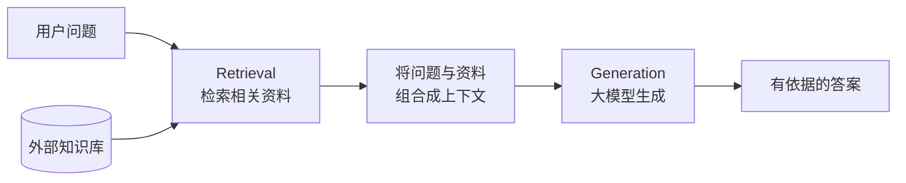
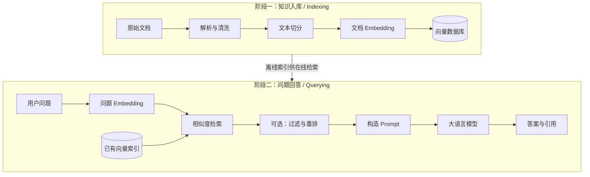
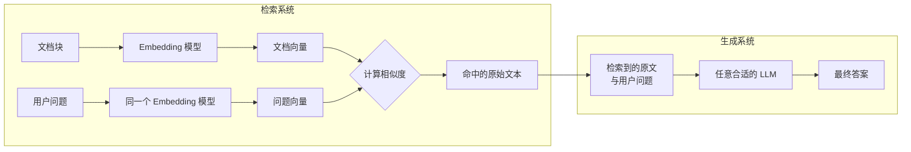
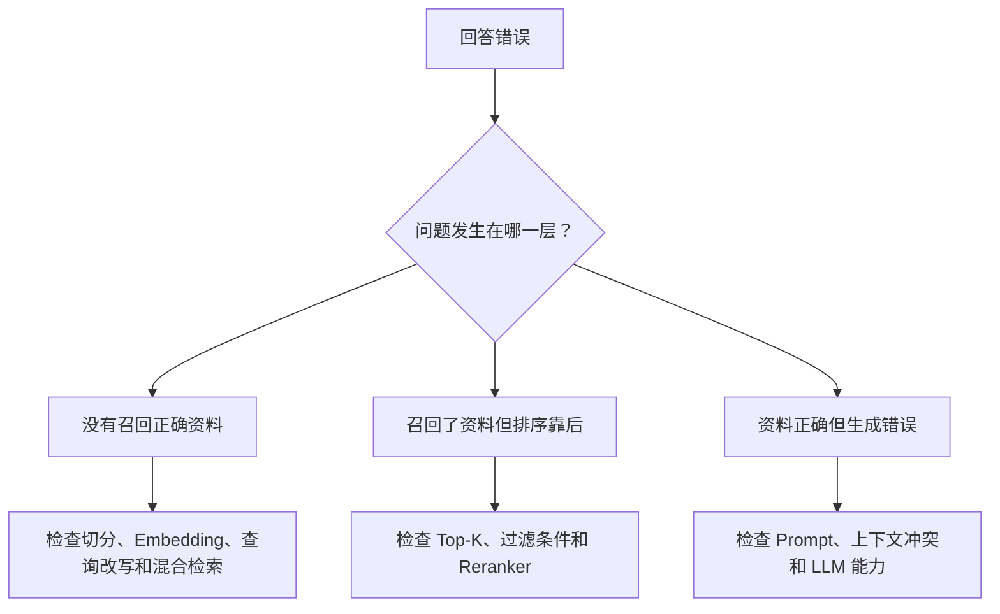
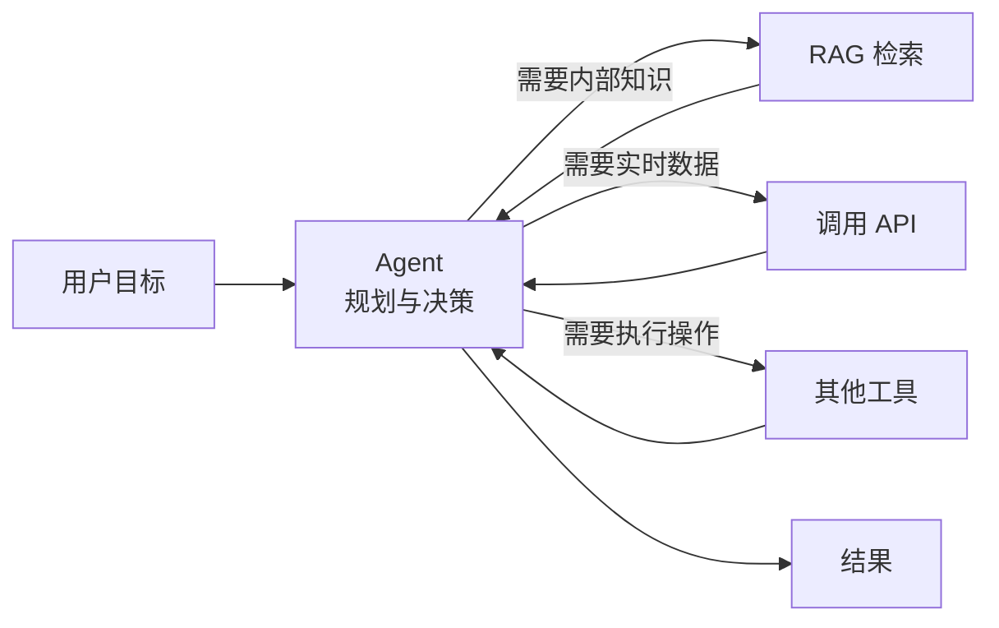

## 为什么需要 RAG？

大语言模型（Large Language Model，LLM）并不是一座实时更新、无所不知的数据库。它通常面临三个问题：

1. **不知道私有数据**：例如公司内部文档、项目需求、个人笔记、产品说明书和企业数据库。
2. **训练知识可能过期**：例如代码库 API、业务数据、新闻事件和技术进展。
3. **缺少依据时可能产生幻觉**：模型可能给出表达流畅、听起来合理，却没有事实支撑的答案。

RAG（Retrieval-Augmented Generation，检索增强生成）的思路很直接：**在让大模型回答之前，先从外部知识库中检索相关资料，再把资料连同问题一起交给大模型。**



因此，RAG 的本质不是让模型“记住更多”，而是让模型在回答时能够**查到正确、足够且可信的上下文**。

## RAG 的两个阶段

一个完整的 RAG 系统分为两个阶段：离线的**知识入库**和在线的**问题回答**。



### 阶段一：知识入库

知识入库的目标，是把不同来源的文档处理成**可检索的文本块**。

1. **加载文档**：读取 PDF、Markdown、Word、网页或数据库记录。
2. **解析与清洗**：提取正文，去除页眉、页脚、导航栏等噪声，并尽量保留标题层级。
3. **文本切分（Chunking）**：把长文档切成若干文本块。切分不是越碎越好，每个块应表达相对完整的语义，同时控制长度。
4. **Embedding 向量化**：把每个文本块映射为一组数字。语义越相似的文本，向量在空间中通常越接近。
5. **写入向量数据库**：保存向量、原文以及来源、页码、标题等元数据。

一条向量记录通常类似下面这样：

```json
{
  "id": "travel-guide-12-03",
  "text": "武侯祠是纪念诸葛亮的重要历史文化景点。",
  "vector": [0.12, -0.38, 0.71],
  "metadata": {
    "source": "成都旅游攻略.pdf",
    "page": 12,
    "section": "三国文化"
  }
}
```

元数据不只是为了展示引用，还可以用于检索前过滤。例如，用户只想查询“2026 年的产品文档”时，可以先按年份和文档类型缩小范围，再进行向量检索。

### 阶段二：问题回答

当用户提出问题时，系统会执行以下步骤：

1. **问题向量化**：使用 Embedding 模型把问题转换为向量。
2. **召回（Recall）**：在向量数据库中查找与问题最相似的若干文本块，常用参数记作 Top-K。
3. **过滤与重排（Rerank）**：可选。先过滤不符合条件的结果，再用重排模型从候选文本中选出最相关的内容。
4. **构造 Prompt**：把用户问题、检索结果和回答规则组织成大模型的输入。
5. **生成答案**：大模型根据提供的上下文回答，并尽可能给出来源。

例如，用户提问：

```text
我喜欢三国历史，在成都应该去哪里？
```

系统检索到相关资料后，可以构造这样的 Prompt：

```text
你是一名旅游助手。请只根据参考资料回答；如果资料不足，请明确说明。

参考资料：
[1] 武侯祠是纪念诸葛亮的重要历史文化景点。
[2] 锦里位于武侯祠旁边，具有三国文化特色。

用户问题：
我喜欢三国历史，在成都应该去哪里？
```

大模型便可以给出有依据的回答：

```text
你可以优先参观武侯祠，它与诸葛亮和三国文化密切相关；
之后还可以游览旁边的锦里。[1][2]
```

## 最容易混淆的地方：哪些模型需要匹配？

先给出结论：

> **文档使用的 Embedding 模型不需要和负责生成答案的大语言模型匹配。真正需要匹配的是：文档向量和用户问题向量必须处于同一个向量空间。实践中，应使用同一个 Embedding 模型及版本，并分别遵循它对文档侧和查询侧的输入要求。**

Embedding 模型和大语言模型承担的是两种不同职责：



- **Embedding 模型负责“找资料”**：它把文档和问题映射到同一个向量空间，以便计算语义相似度。
- **大语言模型负责“读资料并组织答案”**：它接收的是检索出来的原始文本，而不是文档向量。

所以，完全可以使用本地 Embedding 模型建立索引，再把检索结果交给云端大语言模型；也可以替换生成模型，而不重新生成文档向量。

反过来，如果只替换问题侧的 Embedding 模型，通常会导致以下问题：

- 向量维度可能不同，数据库甚至无法执行相似度计算；
- 即使维度相同，两个模型的坐标空间也没有对齐，距离不再代表可靠的语义相似度；
- 随意改变分词、归一化或输入指令等配置，也可能让检索质量明显下降。

这里的“同一个模型”不代表两侧输入必须逐字采用相同格式。有些非对称检索模型会明确要求文档加 `passage:` 前缀、问题加 `query:` 前缀，或者分别指定“文档检索”和“查询检索”任务类型。它们是同一模型体系中配套的文档侧与查询侧配置，应遵循模型说明使用，而不是强行统一。

因此，更准确的工程规则是：

| 变更 | 是否需要重新生成文档向量 |
| --- | --- |
| 更换生成答案的 LLM | 否 |
| 修改 Prompt | 否 |
| 调整 Top-K 或重排策略 | 否 |
| 更换 Embedding 模型或版本 | 是 |
| 改变文档侧且会影响向量输出的 Embedding 配置 | 是 |
| 修改切分策略或文档内容 | 对受影响的文本块重新生成 |

### 相似度是怎样计算的？

向量检索常使用余弦相似度。设问题向量为 $q$，文档向量为 $d$：

$$
\operatorname{cosine\_similarity}(q,d)
= \frac{q \cdot d}{\lVert q \rVert\,\lVert d \rVert}
$$

分数越高，通常表示问题与文档块的语义越相近。实际系统也可能使用点积或欧氏距离，具体取决于 Embedding 模型和向量数据库的约定。

## 文本切分为什么重要？

RAG 的效果不只取决于模型，切分策略往往同样关键。

- **文本块太大**：容易混入无关内容，占用上下文窗口，检索结果也不够精确。
- **文本块太小**：语义不完整，答案需要的信息可能分散在多个块中。
- **没有重叠**：句子或段落边界处的信息可能被截断。
- **忽略文档结构**：标题、章节和表格被拆散后，文本块会失去上下文。

常见做法是优先按标题、段落或语义边界切分，再用固定长度作为兜底，并保留少量重叠。具体块大小没有通用答案，应结合文档类型、问题粒度和评估结果调整。

## RAG 的核心组件

| 组件 | 作用 | 常见关注点 |
| --- | --- | --- |
| Loader / Parser | 加载并解析文档 | 格式支持、表格处理、噪声清洗 |
| Splitter | 切分文本 | 块大小、重叠、语义完整性 |
| Embedding | 生成文本向量 | 模型一致性、维度、语言能力 |
| Vector Store | 存储和搜索向量 | 相似度算法、过滤、索引性能 |
| Retriever | 召回候选文本 | Top-K、混合检索、查询改写 |
| Reranker | 对候选结果重新排序 | 精度、延迟、成本 |
| LLM | 根据上下文生成答案 | 指令遵循、上下文长度、引用 |

向量检索也不是唯一选择。对于产品编号、错误码或专有名词等精确关键词，传统关键词检索往往更有效。生产系统经常采用**混合检索**：同时执行关键词检索和向量检索，再合并或重排结果。

## 常用的向量数据库

向量数据库没有绝对的“最好”，主要区别在于部署方式、数据规模、过滤能力、混合检索以及团队已有的技术栈。下面列出一些常见选择，这不是性能排名：

| 方案 | 类型 | 更适合什么场景 | 主要特点 |
| --- | --- | --- | --- |
| [Chroma](https://docs.trychroma.com/docs/overview/introduction) | 开源，可本地或云端部署 | 学习、原型和中小型应用 | API 简单，支持文档与元数据、稠密/稀疏向量及混合检索 |
| [pgvector](https://github.com/pgvector/pgvector) | PostgreSQL 扩展 | 业务数据已经存放在 PostgreSQL | 向量与业务表共存，可继续使用事务、JOIN、备份和权限体系 |
| [Qdrant](https://qdrant.tech/documentation/overview/what-is-qdrant/) | 开源，也提供云服务 | 需要自建服务和较强元数据过滤 | 以向量、ID 和 Payload 组织数据，过滤能力直观 |
| [Milvus](https://milvus.io/docs/install-overview.md) | 开源，也有托管服务 | 从本地实验扩展到大规模分布式检索 | 提供 Lite、Standalone 和 Distributed 多种部署形态 |
| [Weaviate](https://docs.weaviate.io/weaviate) | 开源，也提供云服务 | 需要语义检索与关键词检索结合 | 原生支持向量、关键词和混合检索 |
| [Pinecone](https://docs.pinecone.io/guides/get-started/overview) | 全托管服务 | 希望减少数据库部署和运维工作 | 面向生产环境的托管向量检索服务，支持语义、关键词和混合检索 |
| [Elasticsearch](https://www.elastic.co/docs/solutions/search/hybrid-search) | 搜索引擎 | 已经使用 Elastic，或精确关键词同样重要 | 可以在一次查询中结合全文检索和向量检索 |

还有一个经常出现的名字是 [FAISS](https://github.com/facebookresearch/faiss)。它是一个高效的向量相似度搜索与聚类**算法库**，不是完整的向量数据库。FAISS 很适合本地实验、离线检索或作为系统底层索引，但持久化、元数据过滤、权限、备份和分布式服务通常需要自行补充。

选择时可以先问四个问题：

1. 团队是否已经在使用 PostgreSQL 或 Elasticsearch？如果是，先评估在现有系统上增加向量检索，往往比引入新数据库简单。
2. 是否愿意维护数据库集群？不愿意时优先考虑托管服务；需要数据私有化时考虑自建方案。
3. 检索是否依赖复杂元数据过滤、关键词匹配或多租户隔离？
4. 数据规模、写入频率、查询延迟和成本目标分别是多少？应使用自己的数据压测，而不是只参考产品宣传。

## 常用的 Embedding 模型

Embedding 模型可以分为两类：通过 API 使用的托管模型，以及可以在本地或私有环境部署的开放权重模型。

### API 模型

| 模型 | 更适合什么场景 | 需要注意什么 |
| --- | --- | --- |
| OpenAI [`text-embedding-3-small`](https://developers.openai.com/api/docs/models/text-embedding-3-small) | 通用文本检索，优先考虑速度和成本 | 适合先作为基线，再根据评估决定是否升级 |
| OpenAI [`text-embedding-3-large`](https://developers.openai.com/api/docs/models/text-embedding-3-large) | 对英文和非英文检索质量要求更高 | 向量和调用成本通常高于 small，应比较实际收益 |
| Google [`gemini-embedding-2`](https://ai.google.dev/gemini-api/docs/embeddings) | 文本、图片、音频、视频和 PDF 的跨模态检索 | 进行纯文本检索时，应按官方格式分别处理查询与文档输入 |
| Cohere [`embed-v4.0`](https://docs.cohere.com/docs/cohere-embed) | 多语言或文本与图片混合的检索 | 调用时要正确设置文档、查询等输入类型 |

API 模型的优点是接入快、不需要准备推理基础设施；代价是持续调用成本、网络延迟，以及需要评估数据合规和服务可用性。

### 可本地部署的模型

| 模型 | 更适合什么场景 | 主要特点 |
| --- | --- | --- |
| [BAAI/bge-m3](https://huggingface.co/BAAI/bge-m3) | 中文、多语言和混合检索 | 支持 100 多种语言，并可同时用于稠密、稀疏和多向量检索 |
| [Qwen3-Embedding 系列](https://huggingface.co/Qwen/Qwen3-Embedding-4B) | 中文、多语言、代码和长文本检索 | 提供 0.6B、4B、8B 等规格，可按机器资源和效果要求选择 |
| [jina-embeddings-v3](https://huggingface.co/jinaai/jina-embeddings-v3) | 多语言长文本和任务化检索 | 区分 `retrieval.query` 与 `retrieval.passage` 任务；使用前还要检查其许可证是否符合项目需求 |

本地模型可以让数据留在自己的环境中，也更容易固定模型版本；代价是需要自行承担模型加载、批处理、GPU/CPU 资源、吞吐量监控和版本升级。

### 应该怎样选择 Embedding 模型？

不要只根据模型大小或公开排行榜做决定。更可靠的流程是：

1. 从一个接入简单、语言能力匹配的模型开始，建立基线；
2. 从真实业务中整理一组“问题—正确文档”评估集；
3. 比较 Top-K 召回率、排序质量、延迟、索引大小和成本；
4. 确认模型是否支持所需语言、最长文本、任务指令和部署方式；
5. 选定模型、版本、向量维度和文档侧配置后，将它们记录进索引元数据。

无论选择哪一个模型，都要遵守前文的规则：**同一个索引中的文档向量和问题向量必须来自兼容的 Embedding 模型空间。**切换模型、版本或向量维度后，旧向量不能直接与新向量混用，通常需要重新生成整个索引。

## 一个 RAG 系统如何失败？

RAG 并不能自动消除幻觉。可以把失败分成三层：



评估时也应分层观察，而不是只看最终答案：

- **检索指标**：正确资料是否出现在 Top-K 结果中；
- **排序指标**：最有用的资料是否排在前面；
- **生成指标**：答案是否忠于上下文、是否完整、引用是否正确；
- **系统指标**：延迟、成本以及知识更新是否及时。

这种拆分能快速判断问题究竟在“没找到”，还是“找到了但没答好”。

## RAG 与 Agent 的关系

RAG 不是 Agent，而是 Agent 可以调用的一种能力。

> RAG 解决“从知识库中找到相关资料”，Agent 解决“为了完成目标，下一步应该做什么”。



RAG 通常是一条相对固定的“检索 + 生成”链路；Agent 则会在循环中推理、规划和调用工具。一个 Agent 可以在需要内部知识时使用 RAG，也可以调用 API、数据库或代码执行工具完成其他任务。

## 总结

RAG 的核心链路可以概括为：

1. 把文档切分并向量化，建立可检索的知识库；
2. 把用户问题映射到与文档相同的向量空间；
3. 检索、过滤并重排相关文本；
4. 把原始文本和问题交给大语言模型生成答案；
5. 分别评估检索质量与生成质量，持续优化。

最后再强调一次最关键的边界：**Embedding 模型决定如何检索，LLM 决定如何生成。文档 Embedding 不需要与 LLM 匹配；文档向量与问题向量才需要由同一个 Embedding 模型体系生成。**
