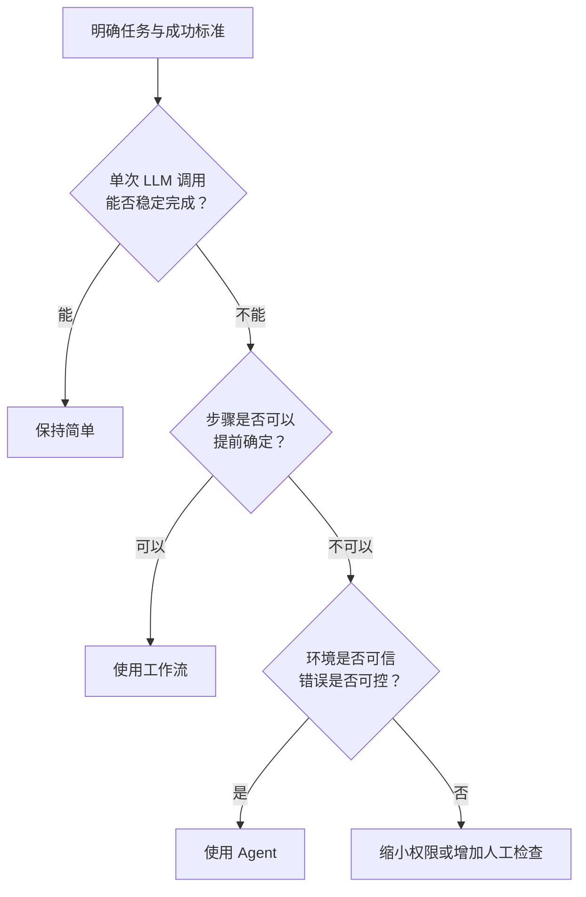
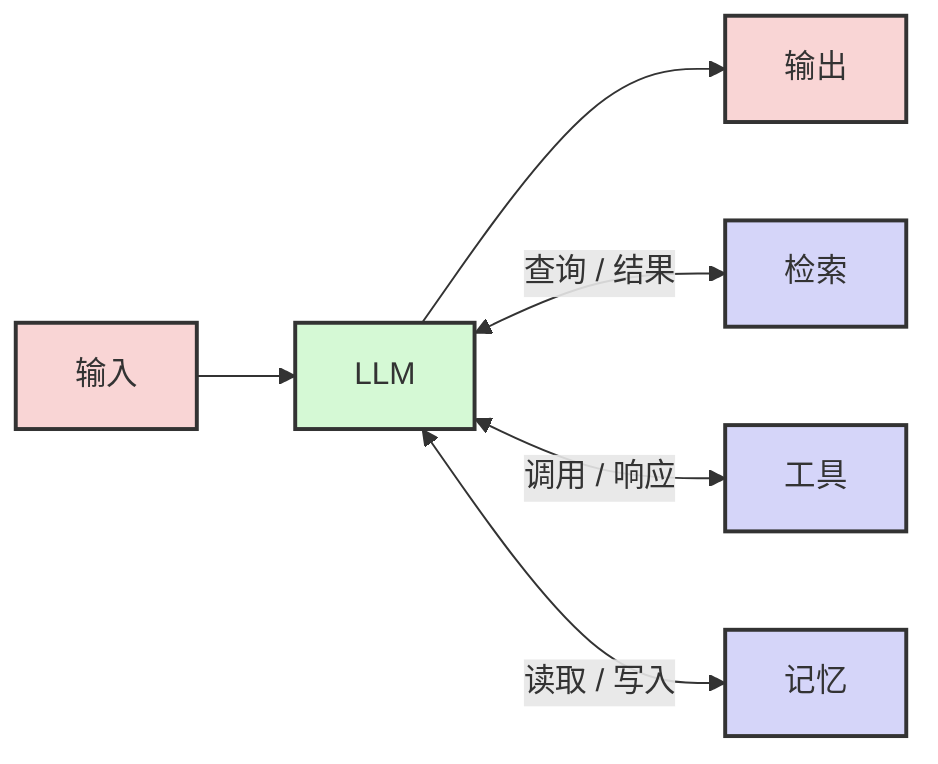
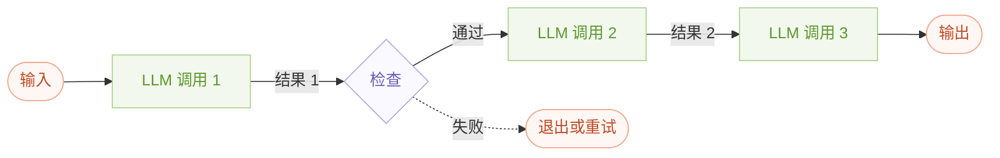
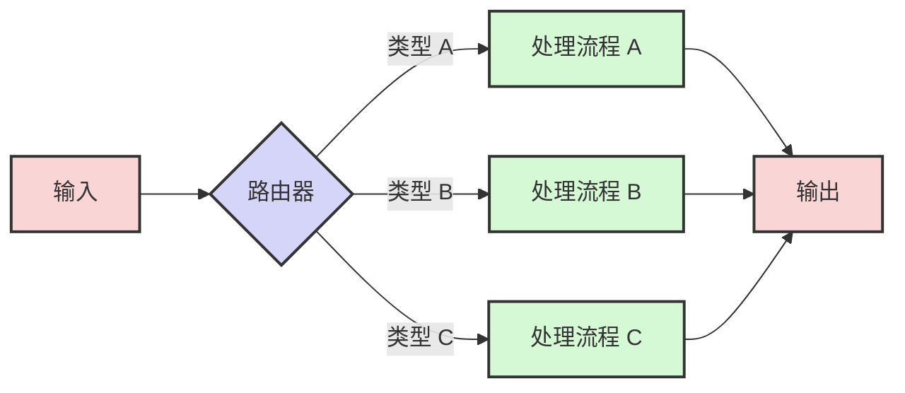
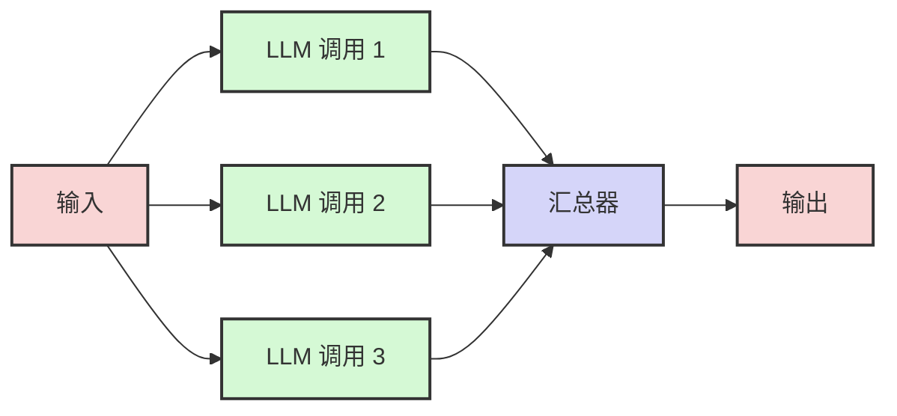
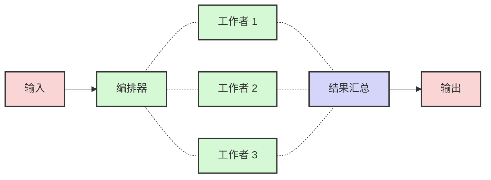
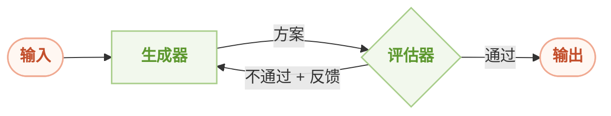
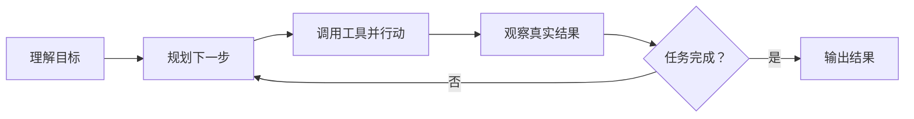

构建 AI 应用时，我们很容易被“智能体”这个词吸引，仿佛只要让模型自主规划、调用工具，系统就会自然变得更聪明。

实际情况往往相反：系统越自主，成本、延迟和出错方式也越难控制。真正有效的方案，不是从最复杂的 Agent 开始，而是从**能够解决问题的最简单方案**开始，再根据评估结果逐步增加复杂度。

这篇文章想回答三个问题：

1. 工作流和智能体到底有什么区别？
2. 常见的 LLM 工作流分别适合什么场景？
3. 什么时候才真的需要一个能够自主行动的 Agent？

## 先记住这几个结论

如果之后没有时间重读全文，记住下面五点就够了：

1. **先尝试单次 LLM 调用。** 很多问题通过更好的上下文、检索和示例就能解决。
2. **步骤固定时，用工作流。** 它更容易测试、观察和控制。
3. **步骤无法预先确定时，再用智能体。** 自主性应该用来处理真正的不确定性。
4. **每增加一层复杂度，都要能换来可衡量的收益。** 否则只是在增加成本和故障点。
5. **工具设计决定 Agent 的上限。** 工具接口、返回结果和文档必须清晰，模型才可能稳定使用它们。

可以把选型过程压缩成下面这条路径：

## 工作流和智能体有什么区别？

两者都可能使用 LLM、检索、记忆和外部工具，真正的区别在于：**由谁决定下一步做什么。**

| 类型 | 谁决定执行路径 | 优点 | 代价 | 适合的任务 |
| --- | --- | --- | --- | --- |
| 工作流（Workflow） | 预先编写的代码 | 稳定、可预测、容易测试 | 灵活性较低 | 步骤明确、边界清楚的任务 |
| 智能体（Agent） | LLM 根据当前状态动态决定 | 灵活，能处理开放式问题 | 成本更高，错误可能累积 | 步骤数量和执行路径难以预先确定的任务 |

举个直观的例子：

- “先提取合同条款，再按固定规则分类，最后生成摘要”是工作流。
- “检查一个陌生代码库，自己判断要读哪些文件、运行哪些命令并完成修改”更接近智能体。

这也意味着，**不是所有使用工具的 LLM 都是 Agent**。如果工具调用顺序由代码写死，它仍然是工作流。

## 基础构建模块：增强型 LLM

无论最终采用工作流还是智能体，基础都是一个被“增强”的 LLM。模型除了生成文本，还可以获得三类能力：

- **检索（Retrieval）**：从文档、数据库或网络中查找所需信息。
- **工具（Tools）**：调用搜索、计算、代码执行或业务系统等外部能力。
- **记忆（Memory）**：读取和保存跨步骤、跨会话需要保留的信息。

模型能否稳定使用这些能力，很大程度上取决于接口设计。一个好工具应该有清楚的名字、明确的参数、可理解的返回结果，以及足够具体的使用说明。

MCP（Model Context Protocol，模型上下文协议）提供了一种标准化的连接方式，让模型可以通过统一接口接入外部工具和数据。不过，MCP 解决的是“如何连接”，并不会自动解决工具本身是否易用的问题。

## 要不要使用框架？

框架能帮助我们快速搭建原型，但也会隐藏提示词、工具调用和状态流转的细节。调试 Agent 时，很多问题恰恰出在这些被隐藏的地方。

因此，更稳妥的顺序是：

1. 先用 LLM API 实现最小可行版本。
2. 理解每一次模型调用的输入、输出和停止条件。
3. 当重复代码和状态管理真的成为负担时，再引入框架。
4. 即使使用框架，也要保留查看底层调用和日志的能力。

框架的价值是减少工程成本，而不是替我们做架构判断。

## 五种常见工作流

下面五种模式并不是互斥的。一个真实系统可能先路由，再并行处理，最后进入评估优化循环。理解它们的关键，是看清每种模式在解决哪一种不确定性。

### 1. 链式调用：把复杂任务拆成固定步骤

链式调用（Prompt Chaining）把任务拆成一系列顺序执行的步骤，每次 LLM 调用只处理一个更小、更清楚的问题。中间还可以加入程序化检查，避免错误继续向后传播。

**适合：** 任务可以被清晰拆分，而且每一步的输入和输出都比较稳定。

**代价：** 调用次数增加，延迟也会随之增加；如果前一步出错，错误可能传递到后面。

**例子：**

- 先生成营销文案，再翻译成目标语言。
- 先生成文章大纲，检查是否覆盖关键点，再根据大纲写正文。
- 先从合同中提取字段，验证字段格式，再写入业务系统。

### 2. 路由：让不同输入走不同路径

路由（Routing）先判断输入属于哪一类，再把它交给对应的提示词、工具或模型。它的价值在于分离不同问题，避免一个“大而全”的提示词同时兼顾所有场景。

**适合：** 输入可以被可靠分类，而且不同类别需要明显不同的处理方式。

**代价：** 一旦分错路由，后面的流程再强也很难补救，因此要重点评估分类准确率和兜底策略。

**例子：**

- 将客服问题分为一般咨询、退款请求和技术支持，再交给不同流程处理。
- 将常见问题交给成本较低的小模型，将复杂问题交给能力更强的模型。
- 根据文档类型，选择不同的解析器和信息提取提示词。

### 3. 并行处理：同时获得速度或多个视角

当多个子任务互不依赖时，可以并行调用 LLM，再通过代码汇总结果。并行处理通常有两种形式：

- **分段（Sectioning）**：把任务拆成不同部分，每部分各自处理。
- **投票（Voting）**：让多个调用独立完成同一任务，再综合判断。

**适合：** 子任务彼此独立，或者单一判断不够可靠，需要多个视角相互补充。

**代价：** 总调用成本会上升；汇总规则如果含糊，多个结果只会带来更多噪声。

**分段示例：**

- 一个调用负责回答用户问题，另一个调用独立检查安全风险。
- 评估一段回答时，让不同调用分别检查事实性、完整性和表达质量。

**投票示例：**

- 让多个独立评审检查代码漏洞，再合并和去重。
- 使用多个提示词判断内容是否违规，并根据风险设置投票阈值。

### 4. 编排器-工作者：动态拆分复杂任务

在编排器-工作者（Orchestrator-Workers）工作流中，中央 LLM 负责理解任务、动态拆分子任务并分配给多个工作者，最后再综合它们的结果。

它和普通并行处理很像，但区别很重要：

- 并行处理的子任务是开发者提前定义好的。
- 编排器-工作者的子任务由 LLM 根据当前输入动态决定。

**适合：** 我们知道任务需要拆解，却无法预先知道会拆成几部分、每部分具体做什么。

**代价：** 编排结果不稳定，可能出现任务遗漏、重复分配或结果冲突，因此需要明确的汇总规则和完成标准。

**例子：**

- 修改一个陌生代码库：先判断涉及哪些文件，再分别分析和修改。
- 调研一个复杂主题：根据问题动态确定需要检索的子主题，再综合成报告。

### 5. 评估器-优化器：通过反馈反复改进

在评估器-优化器（Evaluator-Optimizer）工作流中，一个 LLM 负责生成答案，另一个 LLM 根据明确标准给出评价和改进意见。生成器根据反馈继续修改，直到结果通过或触发停止条件。

**适合：** 任务有清楚的评价标准，而且反馈确实能让下一轮结果变好。

判断它是否值得使用，可以问两个问题：

1. 人类给出具体反馈后，结果通常会明显改善吗？
2. LLM 能否根据标准给出接近人类质量的反馈？

如果两个答案都是“是”，这个模式通常值得尝试。

**代价：** 循环可能带来较高延迟和成本；如果评估标准模糊，模型可能反复修改却没有真正进步。务必设置最大迭代次数。

**例子：**

- 文学翻译：评估器检查语气、文化含义和表达自然度，再让生成器修改。
- 复杂检索：评估器判断证据是否充分，并决定是否需要继续搜索。
- 代码生成：评估器结合测试和静态检查结果，给出下一轮修改建议。

## 什么时候使用真正的 Agent？

随着模型在理解、推理、规划和工具调用方面变得更可靠，Agent 已经能够处理一些真实的生产任务。它的工作方式并不神秘，本质上仍是一个循环：

Agent 从用户的目标出发，自主决定接下来采取什么行动。每次行动后，它都要读取环境中的真实反馈，例如工具返回值、代码执行结果或文件变化，再据此调整计划。必要时，它也应该暂停并向人类确认。

Agent 更适合以下场景：

- 无法提前预测完成任务需要多少步。
- 执行路径会随着中间结果不断变化。
- 模型拥有足够可靠的工具和环境反馈。
- 任务允许一定的成本和延迟。
- 错误能够被检测、撤销或限制在可接受范围内。

编码 Agent 是一个典型例子。面对“修复这个 Bug”，它可能需要先搜索代码、阅读多个文件、运行测试、分析报错，然后决定修改哪里。文件数量和具体步骤都取决于它在执行过程中发现了什么，很难提前写成固定流程。

不过，自主性不是免费的。Agent 运行得越久，调用成本越高，早期的小错误也越容易在后续步骤中被放大。因此，在生产环境中至少要设置：

- 明确的成功条件和最大迭代次数；
- 工具权限、资源消耗和执行时间限制；
- 对高风险操作的人工确认；
- 完整的工具调用记录和可观察性；
- 沙盒、回滚机制以及覆盖真实场景的测试。

## 如何组合这些模式？

这些模式不是只能单独使用。一个客服系统可能先通过**路由**判断问题类型，再通过**链式调用**完成信息提取和回复；高风险回复还可以进入**评估器-优化器**循环。

组合时需要警惕一个倾向：为了让系统看起来更“智能”，不断叠加模型调用。更好的判断标准是：

> 这个新增步骤，是否解决了一个已经被评估证实的问题？

如果没有评估数据支持，就很难知道复杂度究竟带来了提升，还是只是让系统更慢、更贵、更难调试。

## 工程实践中的三个原则

### 1. 保持简单

先用单次调用解决问题，再考虑工作流，最后才是 Agent。复杂度应该来自任务本身，而不是来自我们对技术形式的偏好。

### 2. 保持透明

让系统的规划、工具调用、关键判断和失败原因可以被观察。没有可观察性，就无法判断问题出在模型、提示词、工具还是数据。

### 3. 认真设计 Agent-Computer Interface

ACI（Agent-Computer Interface，智能体与计算机的接口）可以理解为 Agent 版本的用户界面。工具名称是否清楚、参数是否容易填对、错误信息是否有帮助，都会直接影响 Agent 的表现。

对人类来说，一个难用的界面会降低效率；对 Agent 来说，一个含糊的工具接口会直接制造错误。

## 复习速查表

| 遇到的问题 | 优先考虑的模式 |
| --- | --- |
| 一个复杂任务可以拆成固定顺序 | 链式调用 |
| 不同输入需要不同处理方式 | 路由 |
| 多个子任务互不依赖 | 并行处理：分段 |
| 同一判断需要多个独立视角 | 并行处理：投票 |
| 子任务数量和内容无法提前确定 | 编排器-工作者 |
| 有明确标准，结果可通过反馈持续改进 | 评估器-优化器 |
| 连执行路径和步骤数量都无法预先确定 | Agent |

最后，用五个问题检查自己的设计：

1. 单次 LLM 调用真的不够吗？
2. 如果增加步骤，具体会改善哪个指标？
3. 任务路径能否由代码提前确定？
4. 每一步是否都有真实反馈、停止条件和失败处理？
5. Agent 的工具是否足够清楚、安全、可测试？

## 总结

构建有效的 AI 系统，不是追求最复杂的架构，而是选择与问题相匹配的复杂度。

**能用单次调用解决，就不要急着引入工作流；能用固定工作流解决，就不要急着交给 Agent。** 只有当任务本身具有开放性，执行路径无法预先确定，并且自主性带来的收益能够覆盖成本和风险时，Agent 才是合适的选择。

说到底，真正重要的不是系统“像不像一个智能体”，而是它能否稳定、透明、可维护地完成任务。
