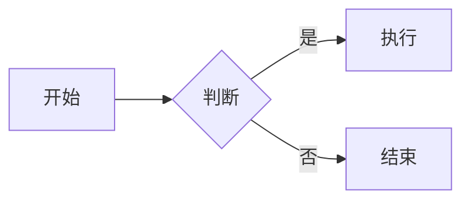

# Jekyll Chirpy 个人博客开发计划

## � 项目信息

| 项目 | 信息 |
|------|------|
| **仓库** | Turing-Cat.github.io |
| **主题** | [Jekyll Chirpy](https://github.com/cotes2020/jekyll-theme-chirpy) (⭐9.7k) |
| **Demo** | https://chirpy.cotes.page |
| **技术栈** | Jekyll + GitHub Pages |

---

## ✅ 开发任务清单

### 阶段一：环境准备
- [ ] 检查 Ruby 环境（需 >= 2.7）
- [ ] 安装 Bundler
- [ ] 备份现有仓库内容

### 阶段二：项目初始化
- [ ] 清理现有文件（保留 .git）
- [ ] 使用 Chirpy Starter 模板初始化
- [ ] 安装依赖 (`bundle install`)

### 阶段三：基础配置
- [ ] 配置 `_config.yml`
  - [ ] 网站标题、描述
  - [ ] URL: `https://turing-cat.github.io`
  - [ ] 作者信息
  - [ ] 时区: `Asia/Shanghai`
  - [ ] 语言: `zh-CN`
  - [ ] 社交链接

### 阶段四：内容创建
- [ ] 编写 `_tabs/about.md` 关于页面
- [ ] 创建第一篇示例文章
- [ ] 添加头像图片

### 阶段五：本地测试
- [ ] 本地预览 (`bundle exec jekyll serve`)
- [ ] 验证首页显示
- [ ] 验证文章渲染
- [ ] 测试深色/浅色模式
- [ ] 测试数学公式渲染
- [ ] 测试 Mermaid 流程图

### 阶段六：发布上线
- [ ] 提交代码到 GitHub
- [ ] 验证 GitHub Actions 构建
- [ ] 访问在线网站确认

---

## 📁 目录结构

```
Turing-Cat.github.io/
├── _config.yml              # 网站配置文件
├── _data/
│   ├── contact.yml          # 社交链接配置
│   ├── locales/             # 多语言文件
│   └── share.yml            # 分享按钮配置
├── _posts/                  # 📝 博客文章目录
│   └── 2026-01-20-hello-world.md
├── _tabs/                   # 导航页面
│   ├── about.md             # 关于我
│   ├── archives.md          # 归档
│   ├── categories.md        # 分类
│   └── tags.md              # 标签
├── assets/
│   └── img/
│       ├── avatar.png       # 头像
│       └── favicons/        # 网站图标
├── Gemfile                  # Ruby 依赖
├── .github/
│   └── workflows/
│       └── pages-deploy.yml # GitHub Actions 自动部署
└── plan.md                  # 本文件
```

---

## 🔧 配置详情

### _config.yml 关键配置

```yaml
# 基础信息
title: "张家辉的博客"
tagline: "技术 · 生活 · 思考"
description: "分享技术笔记和学习心得"
url: "https://turing-cat.github.io"

# 语言和时区
lang: zh-CN
timezone: Asia/Shanghai

# 作者信息
author: 张家辉

# 头像
avatar: /assets/img/avatar.png

# 社交链接
social:
  name: 张家辉
  email: your-email@example.com
  links:
    - https://github.com/Turing-Cat

# 主题模式（留空则自动切换）
theme_mode: 

# 评论系统（可选）
comments:
  provider: giscus  # 推荐使用 Giscus
```

---

## 📝 文章写作格式

### 文件命名
```
_posts/YYYY-MM-DD-标题.md
```

### 文章模板

```markdown
---
title: 文章标题
date: 2026-01-20 21:00:00 +0800
categories: [主分类, 子分类]
tags: [标签1, 标签2]
math: true          # 启用数学公式
mermaid: true       # 启用流程图
pin: false          # 是否置顶
---

## 正文内容

这里写 Markdown 内容...

### 数学公式示例

行内公式：$E = mc^2$

块级公式：
$$
\sum_{i=1}^{n} x_i = x_1 + x_2 + \cdots + x_n
$$

### Mermaid 流程图示例



### 代码块示例

```python
def hello():
    print("Hello, World!")
```
```

---

## 🚀 执行命令

### 1. 环境检查
```bash
ruby --version    # 需要 >= 2.7
gem install bundler
```

### 2. 初始化项目
```bash
# 清理现有文件（保留 .git 和 plan.md）
rm -rf _pages Gemfile README.md _config.yml index.md

# 克隆 Chirpy Starter
git clone https://github.com/cotes2020/chirpy-starter.git temp
cp -r temp/* .
rm -rf temp
```

### 3. 安装依赖
```bash
bundle install
```

### 4. 本地预览
```bash
bundle exec jekyll serve
# 访问 http://localhost:4000
```

### 5. 发布
```bash
git add .
git commit -m "feat: 使用 Jekyll Chirpy 重构博客"
git push origin main
```

---

## ⏰ 预计时间

| 阶段 | 预计耗时 |
|------|----------|
| 环境准备 | 5 分钟 |
| 项目初始化 | 10 分钟 |
| 基础配置 | 15 分钟 |
| 内容创建 | 10 分钟 |
| 本地测试 | 10 分钟 |
| 发布上线 | 5 分钟 |
| **合计** | **约 55 分钟** |

---

## 📚 参考资源

- [Chirpy 官方文档](https://chirpy.cotes.page/posts/getting-started/)
- [Chirpy Wiki](https://github.com/cotes2020/jekyll-theme-chirpy/wiki)
- [Jekyll 官方文档](https://jekyllrb.com/docs/)
- [Markdown 语法指南](https://www.markdownguide.org/)

---

## ✅ 确认开始

计划已就绪，确认后我将按顺序执行：
1. 检查环境
2. 初始化 Chirpy 项目
3. 配置你的个人信息
4. 创建示例文章
5. 本地测试
6. 推送上线
